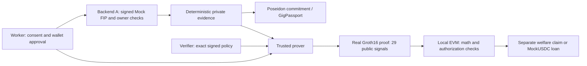

# GigVault

**Portable proof of gig work—without handing over a bank statement.**

GigVault connects authenticated payout evidence to a worker-owned passport. Workers approve a provider's exact requirements; real zero-knowledge proofs disclose whether those requirements pass, while welfare and lending contracts independently authorize each action.

**Hackathon build:** authenticated synthetic financial data, real Poseidon commitments, Circom/Groth16 proofs and local EVM transactions. No paid infrastructure, real Aadhaar authentication, live bank connection or public deployment is required.

## What works

- **Authenticated evidence:** Backend A verifies signed Mock FIP envelopes, valid consent and account-owner matching. Only curated authenticated payout originators count; a transfer description alone cannot turn a family transfer into gig income.
- **Private reconstruction:** canonical evidence is reconstructed for each authorized proof, compared with the current on-chain commitment and discarded. The browser does not submit financial arrays.
- **Worker-owned passport:** a nontransferable Solidity passport with ACTIVE/REVOKED lifecycle, sequential IDs, evidence versions and identity-bound recovery.
- **Real ZK:** constrained income, history and activity comparisons; 29 public signals; a generated Groth16 Solidity verifier.
- **Exact authorization:** verifier-signed immutable policies, explicit EIP-712 worker approval, separate A reconstruction authorization and per-consumer replay protection.
- **Real local actions:** welfare claim, 100 MockUSDC borrowing, exact repayment and identity-based duplicate-claim/debt enforcement.
- **Connected website:** Next.js onboarding and passport dashboard consume the same local backend deployment. The sample phone/Aadhaar screens are explicitly synthetic; wallet authentication and contract actions are real local operations.

## Run locally

Prerequisites: **Node.js 24**, npm, Git and Windows PowerShell. Linux/macOS contributors can run the equivalent npm commands below. Native Circom 2.2.3 assets are checksum-pinned in `circuits/toolchain.json`.

```powershell
git clone https://github.com/ImpactX-26/HACKBUDS.git
cd HACKBUDS
.\Install-And-Start.ps1
```

Open **http://localhost:3000/role**. Enter any 10-digit sample phone number, use OTP **123456**, confirm the sample Aadhaar identity and explicitly approve financial-record consent. Connect the record, review a benefit's policy, sign approval, generate a proof, verify, then claim or borrow. Repay the loan to return debt to zero.

First setup installs free npm dependencies, downloads the pinned compiler/public transcript and builds the circuits. A fresh local proving key can take several minutes. A previously verified development cache is optional and checked against artifact digests; proving keys, financial witnesses and wallet secrets are never committed. Keep the terminal open while presenting. Restarting creates a fresh local chain; refreshing the browser does not reset claim or debt state.

Equivalent setup:

```bash
npm ci --prefix circuits
npm ci --prefix contracts
npm ci --prefix backend
npm ci --prefix frontend
npm --prefix circuits run setup:circom
npm --prefix circuits run build
npm --prefix circuits run predicates:build
cd frontend
# Set GIGVAULT_APP_ORIGIN=http://localhost:3000 in your shell.
npm run dev -- --hostname 127.0.0.1 --port 3000
```

## Architecture



The frontend talks to cookie-authenticated server routes. The server owns private parent/child IPC to the prover. Backend A's SHA-pinned router runs on private loopback transport; this is locally executed A source, not an external bank or separately deployed production service.

## Repository map

| Path | Purpose |
|---|---|
| `frontend/` | Next.js worker, verifier and consumer screens; authenticated server bridge |
| `backend/` | Backend A: Mock FIP, consent, source recognition, evidence and identity adapters |
| `circuits/` | Circom predicates, Poseidon parity, trusted proving service and fixtures |
| `contracts/` | Solidity passport/consumers, local deployment and A→B adapters |
| `shared/proposal/` | Versioned, provisional shared encodings and historical fixtures |
| `docs/reference/` | Preserved locked plans, decisions, frontend requirements and presenter material |
| `docs/review/` | Protocol reviews, compatibility decisions and milestone evidence |
| `docs/ROADMAP.md` | Implemented vs locked-but-unfinished work; approved session updates |
| `docs/VERIFICATION.md` | Reproduction commands and precise evidence boundaries |

## Test evidence

The final connected local demonstration executed **two A reconstructions, two real Groth16 proofs and four successful consumer transactions** on the frontend's deployment. Browser proving took **22.82s** for lending and **21.10s** for welfare; final principal debt was zero.

Existing A→B integration and identity-trust regressions passed **20/20**, and the A-connected HTTP security checks passed **12/12**. These results are scoped to the recorded local checkpoint, not a production audit. See [verification instructions](docs/VERIFICATION.md) and `contracts/reports/local-demo-a-final.json`. The integrated-branch rerun passed **151 Backend A tests, 86 circuit/parity tests, 74 passport/prover tests and 25 A→B/trust/wallet tests**, plus **34 independent-session/adapter tests**, with two newly generated A-derived real proofs and successful consumer receipts. [Exact commands and scope](docs/VERIFICATION.md) distinguish these checks from historical milestones.

## Plans and boundaries

The full locked plans are retained—not replaced by the website's narrower demonstration. Start with [the decision register](docs/reference/GIGVAULT_DECISION_REGISTER.md), [implementation plan](docs/reference/GIGVAULT_LOCKED_IMPLEMENTATION_PLAN.md) and [roadmap](docs/ROADMAP.md).

Evidence profile `gv-poseidon-hash-only-0.2.0` uses the approved BN254 **Fr** scalar modulus and passport schema **2**. Historical v0.1 fixtures remain separate; their passports/proofs are not interchangeable. Other marked REVIEW encodings remain provisional. The illustrative UI Gig Score is not a backend eligibility rule. Amoy deployment, genuine identity/banking verification and a production proving ceremony remain future work.

See [contributing](CONTRIBUTING.md) and [security boundaries](SECURITY.md). No license grant is implied; maintainers must choose a license before third-party redistribution.
